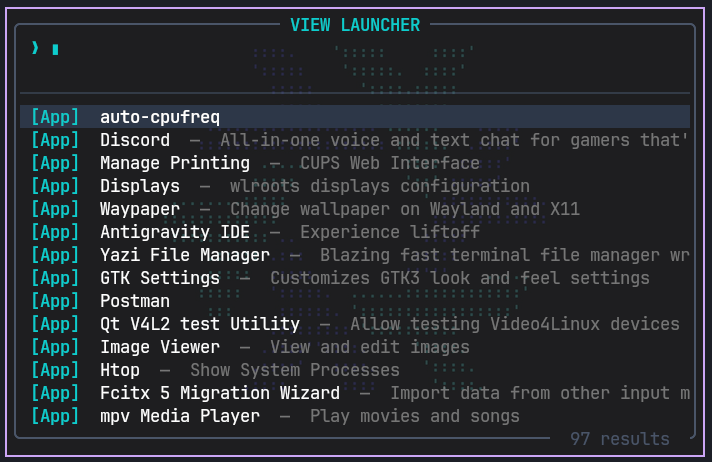

# view-launcher

Trình khởi chạy ứng dụng và tệp tin tối giản, hiệu năng cao (<1ms) được phát triển bằng Rust. Hỗ trợ hoạt động đa nền tảng trên cả Linux (Wayland/X11) và Windows thông qua giao diện dòng lệnh TUI (sử dụng `ratatui` + `crossterm`).



---

## Tính năng nổi bật

- **Tốc độ khởi động vượt trội (<1ms):** Áp dụng cơ chế quét tệp nền bất đồng bộ (background thread scanning) giúp giao diện phản hồi tức thì, không xảy ra hiện tượng giật lag UI.
- **Tìm kiếm thông minh:** Tích hợp tìm kiếm mờ (fuzzy search) cho cả Ứng dụng, Tệp tin và Thư mục.
- **Tự động chuẩn hóa Tiếng Việt:** Hỗ trợ tìm kiếm tiếng Việt không dấu tự động (ví dụ: nhập `tai lieu` sẽ tự động so khớp và tìm ra thư mục `Tài liệu`).
- **Cơ chế bật/tắt nhanh (Toggle):** Nhấn phím tắt để mở và nhấn lại phím tắt đó để tự động đóng (sử dụng TCP Loopback).
- **Khả năng cấu hình cao:** Dễ dàng tùy biến bảng màu giao diện, độ sâu tìm kiếm thông qua tệp cấu hình `config.toml`.

---

## Hướng dẫn cài đặt

### 1. Trên Arch Linux (AUR)

Nếu sử dụng Arch Linux, bạn có thể cài đặt trực tiếp thông qua gói `view-launcher-git` trên AUR bằng các công cụ AUR helper:

```bash
# Cài đặt bằng yay
yay -S view-launcher-git

# Hoặc cài đặt bằng paru
paru -S view-launcher-git
```

Hoặc tiến hành cài đặt thủ công qua Git:

```bash
git clone https://aur.archlinux.org/view-launcher-git.git
cd view-launcher-git
makepkg -si
```

---

### 2. Biên dịch từ nguồn (Các hệ điều hành khác)

Biên dịch trực tiếp từ mã nguồn để tạo ra một tệp thực thi duy nhất, không phụ thuộc vào bất kỳ thư viện ngoài nào:

```bash
cargo build --release
```

Tệp nhị phân sau khi biên dịch sẽ nằm tại: `target/release/view-launcher` (hoặc `view-launcher.exe` trên Windows).

---

## Cấu hình phím tắt và Khởi chạy

### 1. Trên Linux (Sway / i3 / Hyprland)

Chép tệp thực thi vào thư mục hệ thống cục bộ:

```bash
cp target/release/view-launcher ~/.local/bin/
```

Mở tệp cấu hình của Window Manager (ví dụ: `~/.config/sway/config`) và cấu hình cửa sổ nổi kèm phím tắt gọi nhanh:

```plaintext
# Thiết lập cửa sổ nổi cho launcher
for_window [app_id="floating_launcher"] floating enable, resize set 700 450, move position center

# Gán phím tắt gọi launcher trong terminal mặc định (ví dụ: kitty)
# Sử dụng tiền tố env để ngắt kết nối bộ gõ IME (Fcitx/IBus), tránh hiện tượng lỗi giao diện (preedit area)
bindsym ctrl+space exec env XMODIFIERS="" GTK_IM_MODULE=none QT_IM_MODULE=none $term --app-id floating_launcher -e view-launcher
```

*Lưu ý về bộ gõ tiếng Việt:* Trong các ứng dụng TUI chạy trong terminal, nếu bật bộ gõ tiếng Việt, các ký tự bạn nhập có thể bị hiển thị tạm dưới đáy terminal (preedit) trước khi được chèn vào ô tìm kiếm. Việc thêm tiền tố `env XMODIFIERS="" GTK_IM_MODULE=none QT_IM_MODULE=none` trước lệnh gọi terminal sẽ vô hiệu hóa hoàn toàn IME cho riêng cửa sổ này, giúp nhập liệu tiếng Anh trực tiếp và siêu tốc, trong khi các ứng dụng khác vẫn gõ tiếng Việt bình thường.

---

### 2. Trên Windows

Sau khi biên dịch, bạn có thể lưu trữ file thực thi `view-launcher.exe` ở bất kỳ thư mục nào trên hệ thống. 

Ứng dụng hỗ trợ cơ chế tự động thiết lập hệ thống trong lần chạy đầu tiên:
- **Tự khởi chạy cùng hệ thống (Startup):** Tự động tạo shortcut khởi chạy cùng Windows trong thư mục `%APPDATA%\Microsoft\Windows\Start Menu\Programs\Startup`.
- **Đăng ký phím tắt toàn cục (Global Hotkey):** Tự động gán tổ hợp phím `Ctrl + Alt + Space` để mở nhanh Windows Terminal chứa launcher từ bất kỳ màn hình nào.

Để kích hoạt, bạn chỉ cần chạy trực tiếp `view-launcher.exe` một lần, toàn bộ phím tắt và cấu hình khởi động sẽ được thiết lập ngầm tự động.

---

### 3. Tùy chọn phím tắt nâng cao trên Windows (`Ctrl + Space`)

Nếu muốn sử dụng phím tắt ngắn gọn `Ctrl + Space` thay cho phím tắt mặc định `Ctrl + Alt + Space`, bạn có thể cấu hình thông qua công cụ AutoHotkey:

1. Cài đặt AutoHotkey và tạo tệp kịch bản `launcher.ahk` với nội dung:
   ```autohotkey
   ^Space::
   Run, wt.exe --title "floating_launcher" view-launcher.exe
   return
   ```
2. Lưu tệp kịch bản này vào thư mục Khởi động tự động của Windows (`shell:startup`) để tự động kích hoạt cùng hệ thống.

---

## Cấu hình tùy biến (`config.toml`)

Ứng dụng sẽ tự động tải các cấu hình tùy chỉnh từ các thư mục mặc định sau:
- **Linux:** `~/.config/view-launcher/config.toml`
- **Windows:** `%APPDATA%\view-launcher\config.toml`

Mẫu cấu hình tham khảo:

```toml
[theme]
query_color = "cyan"
selection_bg = "#2d3748"
selection_fg = "white"
app_badge_color = "cyan"
file_badge_color = "yellow"
border_color = "#4a5568"

[search]
max_depth = 3
ignored_dirs = [".git", ".cargo", ".cache", "node_modules", "target"]
disable_ime = true # Tự động tắt tạm thời bộ gõ tiếng Việt (Fcitx4/Fcitx5/IBus) khi mở launcher và khôi phục khi đóng (chỉ áp dụng trên Linux)
```
