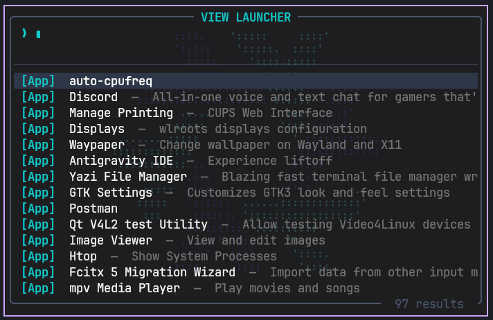

# view-launcher

A minimalist, lightweight application and file launcher for Linux and Windows, built with Rust and Ratatui.



[English](#english) | [Vietnamese](#vietnamese)

---

## English

### Features

- **Fast startup:** Sub-millisecond response time with asynchronous background filesystem scanning.
- **Fuzzy search:** Interactive fuzzy matching with matched character highlighting.
- **Vietnamese accent normalization:** Matches unaccented input against accented filenames (e.g. `tai lieu` matches `Tài liệu`).
- **Nerd Font integration:** Filetype and application icons.
- **Inline calculator:** Computes basic arithmetic expressions directly in the search bar and copies results to clipboard on Enter.
- **Usage-based ranking:** Frequently and recently launched items are prioritized.
- **Text editing & navigation:** Full cursor movement (`Left`, `Right`, `Home`, `End`), word deletion (`Ctrl+W`), line clearing (`Ctrl+U`), and Vim-style navigation (`Ctrl+J`, `Ctrl+K`).
- **Configurable:** Custom search directories, depths, exclusions, pinned apps, and custom commands via `config.toml`.
- **Single-instance toggle:** Uses Unix domain sockets on Linux and named pipes on Windows to toggle the active window.

### Installation

#### Ubuntu / Debian (`.deb`)

Download the latest `.deb` package from [Releases](https://github.com/hieunx1024/view-launcher/releases):

```bash
sudo dpkg -i view-launcher_*_amd64.deb
```

#### Windows

Download `view-launcher-setup.exe` or `view-launcher-windows-x86_64.zip` from [Releases](https://github.com/hieunx1024/view-launcher/releases). The installer adds the binary to your `PATH` and registers the `Ctrl + Alt + Space` startup shortcut.

#### Arch Linux (AUR)

```bash
yay -S view-launcher-git
```

#### Build from Source

```bash
git clone https://github.com/hieunx1024/view-launcher.git
cd view-launcher
cargo build --release
```

Binary output: `target/release/view-launcher` (or `view-launcher.exe` on Windows).

### Keybindings

| Key | Action |
| --- | --- |
| `Enter` | Launch application / Open file / Copy math result |
| `Shift+Enter` / `Alt+T` | Open containing directory in Terminal |
| `Alt+C` | Copy file path or calculation result to clipboard |
| `Tab` | Autocomplete directory path or application name |
| `Ctrl+J` / `Down` / `Ctrl+N` | Move selection down |
| `Ctrl+K` / `Up` / `Ctrl+P` | Move selection up |
| `PageDown` / `Ctrl+D` | Scroll down 5 items |
| `PageUp` | Scroll up 5 items |
| `Left` / `Right` | Move cursor |
| `Home` (`Ctrl+A`) / `End` (`Ctrl+E`) | Move cursor to start / end |
| `Ctrl+W` / `Alt+Backspace` | Delete word backward |
| `Ctrl+U` | Clear search input |
| `Esc` / `Ctrl+C` | Exit |

### Configuration

Configuration files are located at:
- **Linux:** `~/.config/view-launcher/config.toml`
- **Windows:** `%APPDATA%\view-launcher\config.toml`

Example `config.toml`:

```toml
[theme]
query_color = "cyan"
selection_bg = "#2d3748"
selection_fg = "white"
highlight_color = "#f6e05e"
show_icons = true
show_status_bar = true

[search]
paths = [
    { path = "~", max_depth = 2 },
    { path = "~/Projects", max_depth = 4 },
    { path = "~/Documents", max_depth = 3 },
]
ignored_dirs = [".git", "node_modules", "target", "build", ".venv"]
ignored_extensions = [".tmp", ".o", ".lock", ".log"]
enable_path_matching = true
disable_ime = true

[apps]
pinned = ["Google Chrome", "Visual Studio Code", "Terminal"]
hidden = ["Avahi SSH Server", "UXTerm"]

[[apps.custom]]
name = "Lock Screen"
exec = "swaylock -c 000000"
terminal = false

[[apps.custom]]
name = "Neovim Projects"
exec = "nvim ~/Projects"
terminal = true
```

---

## Vietnamese

Trình khởi chạy ứng dụng và tìm kiếm tệp tin tối giản, tốc độ cao cho Linux và Windows, viết bằng Rust.

### Tính năng chính

- **Tốc độ cao:** Quét tệp ngầm bất đồng bộ, phản hồi dưới 1ms.
- **Tìm kiếm mờ (Fuzzy Search):** Tự động tô màu các ký tự so khớp.
- **Chuẩn hóa tiếng Việt:** Tìm kiếm không dấu tự động (ví dụ: `tai lieu` tìm `Tài liệu`).
- **Hỗ trợ Nerd Font:** Hiển thị icon theo loại file và ứng dụng.
- **Máy tính nhanh:** Nhập biểu thức toán học trực tiếp trong thanh tìm kiếm, nhấn `Enter` để copy kết quả.
- **Xếp hạng theo tần suất:** Ưu tiên hiển thị các ứng dụng và tệp tin mở thường xuyên.
- **Điều hướng con trỏ:** Hỗ trợ phím di chuyển con trỏ, xóa từ (`Ctrl+W`), xóa dòng (`Ctrl+U`), phím tắt Vim (`Ctrl+J`, `Ctrl+K`).
- **Cấu hình linh hoạt:** Tùy biến thư mục quét, độ sâu, ứng dụng ghim/ẩn và lệnh tùy chỉnh qua `config.toml`.
- **Hỗ trợ đa người dùng:** Dùng Unix domain socket trên Linux và Named pipe trên Windows.

### Cài đặt nhanh

- **Ubuntu / Debian:** Tải gói `.deb` từ mục [Releases](https://github.com/hieunx1024/view-launcher/releases) và cài bằng `sudo dpkg -i view-launcher_*_amd64.deb`.
- **Windows:** Tải `view-launcher-setup.exe` từ mục [Releases](https://github.com/hieunx1024/view-launcher/releases).
- **Arch Linux:** `yay -S view-launcher-git`.

### Giấy phép

Phát hành theo giấy phép [MIT](LICENSE).
